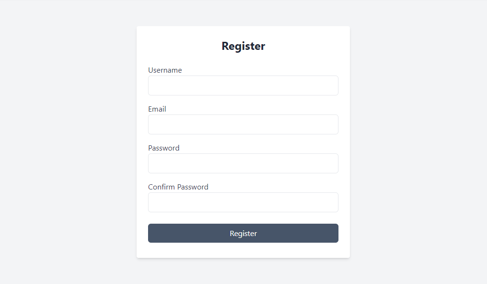

# Fullstack Authentication with React and Django

This project is a fullstack application built using React for the frontend and Django for the backend. It includes user authentication features such as login and registration, and it ensures that only authenticated users can access certain parts of the application.



## Setup and Installation

```
git clone https://github.com/ixedasan/fullstack-authentication.git
cd fullstack-authentication
```

### Backend Setup

Navigate to the backend directory

```
cd backend
```

Set up a virtual environment

```
python -m venv venv
venv\Scripts\activate
```

Install backend dependencies

```
pip install -r requirements.txt
```

Apply migrations

```
python manage.py migrate
```

Create a superuser (optional)

```
python manage.py createsuperuser
```

Run the development server

```
python manage.py runserver
```

**_explanation for beginners_**
You need to open a new terminal without turning off the backend server

### Frontend Setup

Navigate to the frontend directory

```
cd frontend
```

Install frontend dependencies

```
npm install
```

Start the React development server

```
npm run dev
```

## Contributing

Contributions are welcome! Please feel free to submit a Pull Request.
